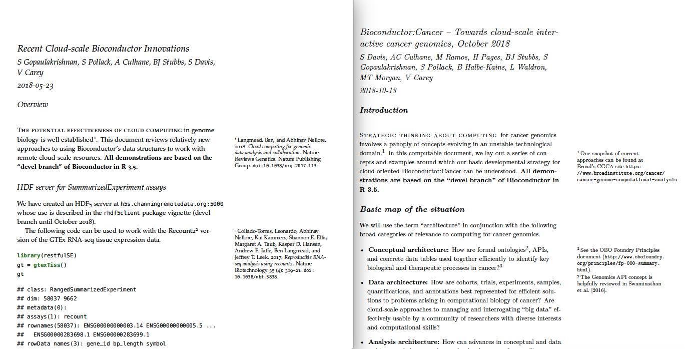

# ITCRpamphlets2018
Pamphlets distributed at ITCR and AACR meetings 2018.  They use an Rmarkdown tufte format, and can be printed in booklet format, two pages to a sheet.  Source code is in inst/pamphlets in the Bioconductor BiocOncoTK package.

